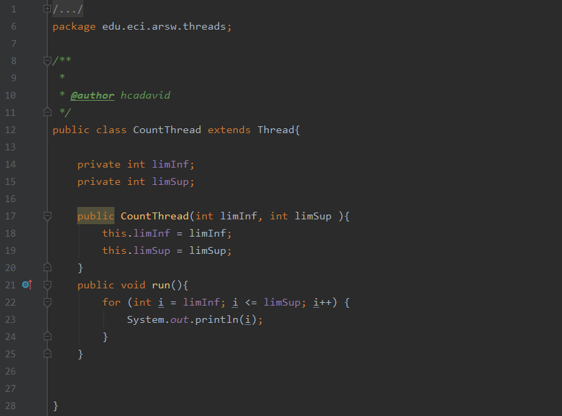
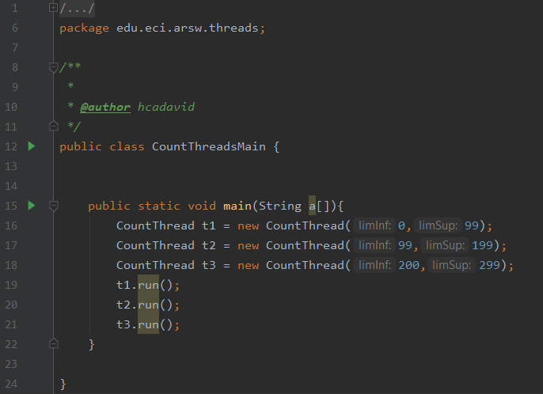
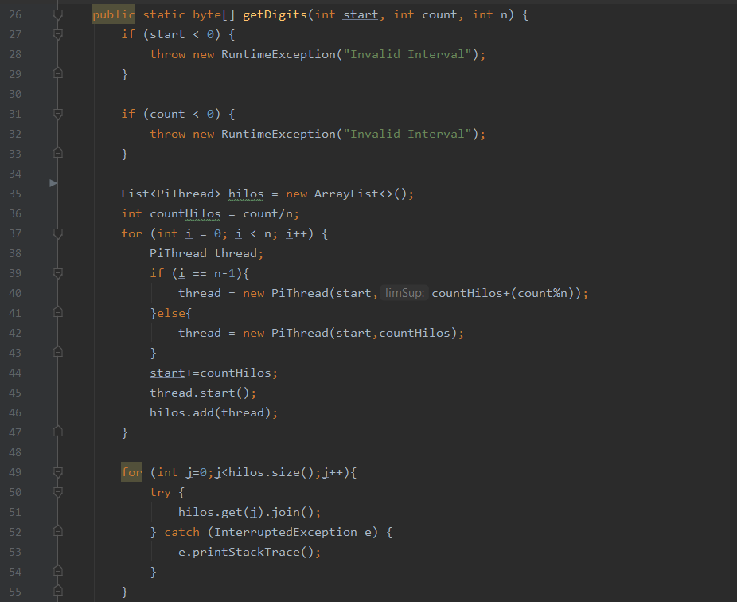

# arsw_lab1

***Part I - Introduction to Java Threads***

As reviewed in the readings, complete the CountThread classes, so that they define the life cycle of a thread that prints the numbers between A and B. 

*Complete the main method of the CountMainThreads class so that:*
1. Create 3 threads of type CountThread, assigning the first one the interval [0..99], the second one [99..199], and the third one [200..299]. 

2. Start all three threads with start(). 

3. Run and check the output on screen. 

4. Change the beginning with start() to run(). How does the output change? Why?

**Usando start**

**Usando run**

  
Usando start los hilos se ejecutan en un un orden diferente al especificado en el codigo, mientras que usando run los hilos se inician de acuerdo a la forma especificada en el codigo. Esto sucede porque al usar el metodo start() se asigna un nuevo hilo y este llama al método run(), esto quiere decir que usando el metodo start() su método run se ejecuta en hilos separados (simultaneamente), mientras que al llamar el método run() directamente no se crean multiples subprocesos por lo que la ejecución se refleja de forma simultanea.

***Part II - BBP Formula Exercise***

The BBP formula (Bailey – Borwein – Plouffe formula) is an algorithm that allows you to calculate the nth digit of PI in base 16, with the particularity of not needing to calculate us n-1 previous digits. This feature makes it possible to convert the problem of calculating a massive number of PI digits (in base 16) to a shamefully parallel one. In this repository you will find the implementation, along with a set of tests.

For this exercise you want to calculate, in the shortest possible time, and in a single machine (taking advantage of the multi-core characteristics of the same) at least the first million digits of PI (in base 16).

1. Create a Thread type class that represents the life cycle of a thread that calculates a portion of the required digits. 

2. Have the PiDigits.getDigits() function receive as an additional parameter an N value, corresponding to the number of threads between which the solution is to be parallelized. Have that function wait until the N threads finish solving the problem to combine the answers and then return the result. For this, review the join method of the Java concurrency API. 

3. Adjust the JUnit tests, considering the cases of using 1, 2 or 3 threads (the last one to consider an odd number of threads!)

***Part III - Performance Evaluation***

From the above, implement the following sequence of experiments to calculate the million digits (hex) of PI, taking their execution times (be sure to do them on the same machine):

1. Single thread. 

3. As many threads as processing cores (have the program determine this using the Runtime API). So many threads as double processing cores. 

3. 200 threads.

5. 500 threads 

When starting the program, run the jVisualVM monitor, and as the tests run, check and record the CPU and memory consumption in each case.

With the above, and with the execution times given, graph solution time vs. Number of threads. Analyze and propose hypotheses with your partner for the following questions (you can take into account what is reported by jVisualVM):

1. According to Amdahls law, where S (n) is the theoretical performance improvement, P the parallel fraction of the algorithm, and n the number of threads, the greater n, the greater the improvement should be. Why is the best performance not achieved with the 500 threads? How does this performance compare when 200 are used?.  

2. How does the solution behave using as many processing threads as cores compared to the result of using twice as much?

3. According to the above, if for this problem instead of 500 threads on a single CPU, 1 wire could be used on each of 500 hypothetical machines, would Amdahls's law be better applied? If, instead, c threads were used in 500 / c distributed machines (where c is the number of cores of said machines), would it be improved? Explain your answer.

